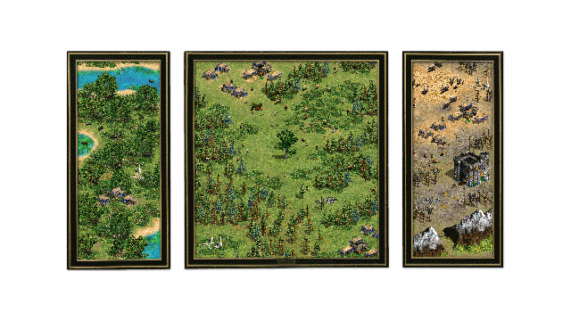

[<cite>The Garden of Earthly Delights</cite>](http://scrnprnt.ca/EarthlyDelightsPresskit.html)  
SCRNPRNT  
2020, Video Game

It's hard to know quite what SCRNPRNT's <cite>The Garden of Earthly Delights</cite> is.
Ostensibly a chatroom,
but kind of an ‘open world’ game
and sort of an homage to the [<cite>Hyronimous Bosch work of the same name</cite>](https://www.museodelprado.es/en/the-collection/art-work/the-garden-of-earthly-delights/02388242-6d6a-4e9e-a992-e1311eab3609).

I was drawn to this as a huge fan on Bosch's work and an equally large fan of <cite>Age of Empires</cite>.
Aesthetically,
the hues of the landscapes match the original closely
and the low-resolution graphics somehow echo the aged textures of the oil paint.
Even the isometric grid plays a roll,
hearkening back to the uncomfortable medieval approaches to perspective.

It's remarkable how well the game captures the spirit of the original tryptich,
despite a distinct lack of demons and surreal constructs.

In a clever usage of assets and AI,
the the left panel is a lush paradise,
where the animals and humans live in peace.
By using slow or immobile sprites,
the population is made tranquil and serene.

Contrast that with the centre panel,
overrun with frenetic creatures stampeding without aim.
Here, archers and fast-moving animals simulate chaos.
The humans indulge,
hunting animals indiscriminately.
These aren't the hunters of the original game,
they don't gather meat.
They only kill.
The animals,
carnivores included,
are passive,
suggesting complete human domination.

Finally,
in the hellscape of the right panel each creature wanders aimlessly
as focussed on their own personal punishment.
They never interact.
The ground is barren and the trees bare.
Fire rises from the buildings and the ground,
but doesn't consume anything.
You could stand and burn forever.
The castle,
aping the background of the original painting,
suggests further distance from the natural order.
Also there's penguins,
the juxtaposition of which heightens the sense of unease.
Nothing is right here.

The garden is eerily poignant.
There was no-one to chat to in the few minutes I spent playing,
but even if there were,
the method of communication is too abstract
and too fraught with distraction to truly communicate.
The frame boxes you in.
You lack control over your environment.
And there is no end, even when killed you reincarnate.
Though the intended as a statement on the the
“representation of nature in games, and the virtual pastoral fantasy”,
it's hard not to see a parallels to the COVID-19 lockdowns.
