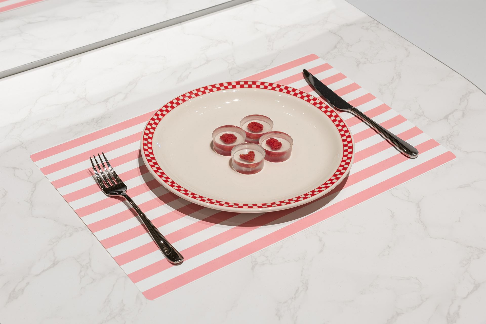
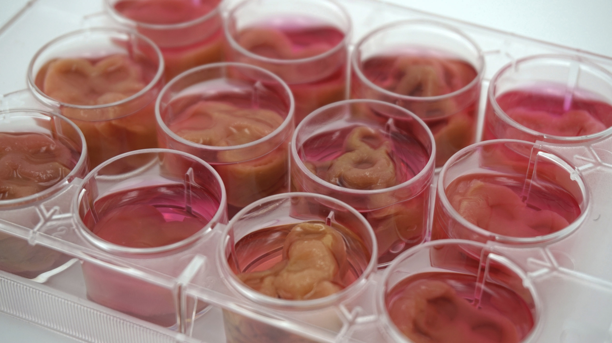
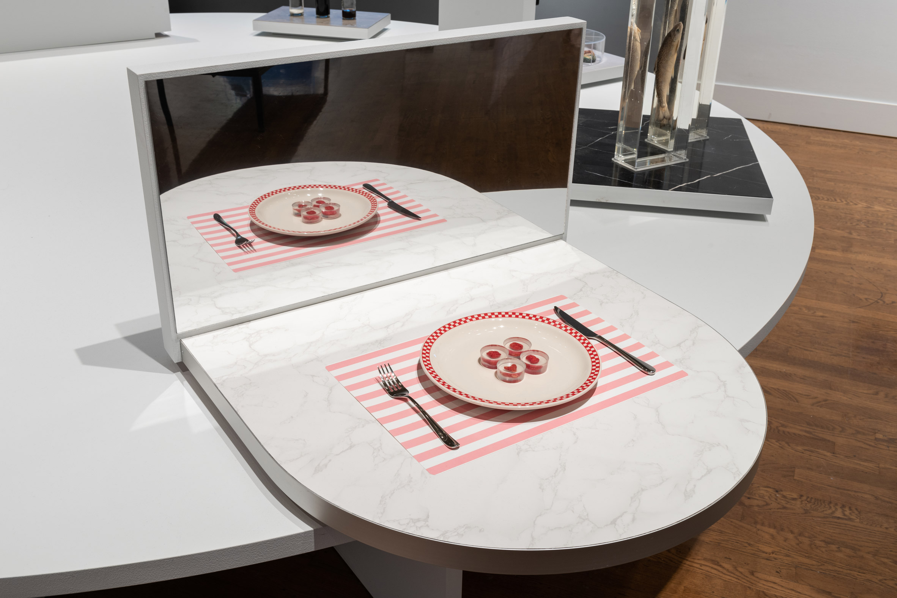

[<cite>Ouroboros Steak</cite>](http://www.gracemknight.com/ouro-steak)  
Andrew Pelling, Orkan Telhan & Grace Knight,  
2019, Installation

In a radical truncation of farm-to-table,
<cite>Ouroboros Steak</cite> is the only truly cruelty free ‘lab-grown’ meat.
Created in a form akin to a child’s science kit,
the steak can be grown by _anyone_, at home,
using cells from a swab of their own cheek.

The resulting amuse-bouche-sized steaks[^1],
as [displayed at The Design Museum](https://designmuseum.org/exhibitions/beazley-designs-of-the-year/product-2020/ouroboros-steak),
are a critical commentary of the clean-meat industry’s claims of sustainability.
These are truly cruelty free,
something the creators argue is not true of existing animal-cell options.

Ouroboros Steaks are grown instead on a serum derived from expired blood donations that would otherwise be wasted.

While the lab-grown meat industry promises sustainable, cruelty-free meat,
it relies on foetal bovine serum (FBS) to grow their cultures.
This serum is created from the blood of cow foetuses
extracted when their mothers are slaughtered by the meat and dairy industries.
Ouroboros Steaks cut through the hype to highlight this dependency on animal agriculture and
at least for now,
dampens the industry’s claims of disruption.

Though scientifically feasible,
Ouroboros Steaks are not meant as a solution.
Much like their namesake[^2],
they are a symbol of new beginnings,
asking,
‘What would be the sacrifices we need to make to be able to keep consuming meat?’

Though no different than biting one’s cheek,
the installation doubles down on the inherent ick of consuming human flesh.
The addition of the mirror before the place setting begs for self-reflection.
‘Meat, but at what cost?‘
Or perhaps it can be seen as the ultimate glorification of self?
A triumph of logic over emotion.

The delicate presentation of the place setting,
which might imply a gourmet restaurant,
contrasts with the homely flatware.
The juxtaposition creates a certain unease
as it apes the fastidious rituals of cannibals such as Jeffrey Dahmer.
In this way the mirror takes on a fetishistic quality,
maximising the visceral feelings of disgust.

The premise calls to mind the 2012 film <cite>Antiviral</cite>,
in which it‘s perfectly normal to consume meat grown from the cells of celebrities.
Unnervingly, its entirely believable that consumerism and celebrity culture could make the concept palatable.

---

[^1]:
    You can’t grow larger cultures without a vascular system
    to transport nutrients and oxygen deep into the tissue.
    One solution is [growing meat on trees](https://www.nationalgeographic.com/news/2017/03/human-heart-spinach-leaf-medicine-science/).

[^2]:
    If you were wondering about the shape of the steaks,
    they’re representations of the [ouroboros](https://en.wikipedia.org/wiki/Ouroboros) curled into various looping configurations.
